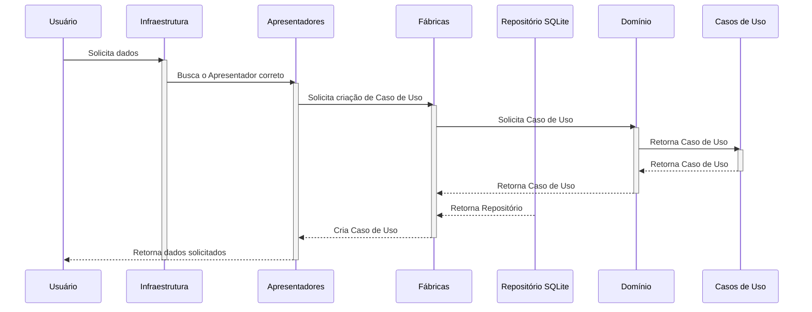

# 🚀 Backend challenge - B2RISE


## Tabela de conteúdos
- [🚀 Tecnologias](#-tecnologias)
- [📂 Estrutura do Projeto](#-estrutura-do-projeto)
- [🚀 Desafio 1 - Typescript](#-desafio-1---typescript)
- [📚 Desafio 2 - SQL](#-desafio-2---sql)
- [🫧 Desafio 3 - Clean Code](#-desafio-3---clean-code)
- [🧩 Desafio 4 - Extra](#-desafio-4---extra)

## 🚀 Tecnologias
- **Node.js**: `>=22.13.1 LTS`
- **npm**: `>=10.9.2`
- **Typescript**: `>=5.7.3`
- **vitest**: `>=3.0.4`

## Estrutura do projeto
```bash
📂 B2RISE
│── 📂 1_typescript      # Todos os testes relacionados ao desafio 1. Testes de Typescript
│
│── 📂 2_queries         # Todos os testes relacionados ao desafio 2. Testes de SQL 
│
│── 📂 3_clean_code      # Todos os testes relacionados ao desafio 3. Testes de Clean Code
│
│── 📂 4_extra             # Extra: Sistema conceitos de Clean Code, Clean Architecture e queries relacionadas ao desafio 2
│
│── 📜 README.md         # Documentação do projeto
│
│── 📜 tsconfig.base.json # Configuração relacionado a utilização de Typescript nos desafios
│
│── 📜 docker-compose.yaml # Conteiner para upload de banco de dados postgres para queries do teste 2
```

## 🚀 Desafio 1 - Typescript
Seguindo a documentação provida para realização do desafio, foi criado uma pasta chamada `1_typescript` onde contém todos os testes relacionados ao desafio 1.
As dependências utilizadas para realização dos testes foram:
- **typescript**: `5.7.3`
- **vitest**: `3.0.4`
- **@types/node**: `22.12.0`

### Instruções
```bash
cd 1_typescript
npm install
npm run test
```

### Estrutura do projeto
```bash
📂 1_typescript
│── 📂 src
│   │── 📂 imutability                          # 1.3 Imutabilidade e Manipulação de Arrays
│   │   │── 📂 error        
│   │   │   │── 📜 not-a-number-error.ts
│   │   │── 📜 make-all-positives.ts            # Função para retornar todos os numeros de um array para positivos
│   │   │── 📜 make-all-positives.spec.ts       # Teste para a função
│   │
│   │── 📂 validation                           # 1.2 Validação e Tipagem com Union Types
│   │   │── 📂 error        
│   │   │   │── 📜 Invalid-operation-error.ts
│   │   │── 📜 calculate.ts                     # Função para retornar o valor de operações aritmetricas
│   │   │── 📜 calculate.spec.ts                # Teste para a função
│   │
│   │── 📂 values                               # 1.1 Manipulação de Tipos e Generics
│       │── 📂 error        
│       │   │── 📜 Invalid-operation-error.ts
│       │── 📜 calculate.ts                     # Função para retornar os valores de uma key de um array de objetos
│       │── 📜 calculate.spec.ts                # Teste para a função
│
│── 📜 package.json                             # Dependências do projeto
│── 📜 package-lock.json
│── 📜 tsconfig.json                            # Configuração do Typescript
```

## 📚 Desafio 2 - SQL
Seguindo a documentação provida para realização do desafio, foi criado uma pasta chamada `2_queries` onde contém todos os testes relacionados ao desafio 2.
Para o teste foi utilizado um container docker com banco de dados postgres para realização das queries juntamente com **Queries** escritas em `.sql` com o objetivo de retornar os dados solicitados.
> [!WARNING]
> Como no desafio 2 foi solicitado para realizar 2 desafios com o mesmo nome de tabela, a tabela `sales` do desafio 2.5 foi renomeada para `payments` para evitar conflitos.

### Instruções
```bash
docker-compose up -d
```

### Estrutura do projeto
Cada desafio foi separado em uma pasta, onde contém 3 arquivos `.sql`, seguindo a seguinte estrutura:
- **create-table.sql**: Query para criação da tabela relacionada ao desafio no banco de dados postgres
- **query-table.sql**: Query para retornar o resultado esperado do desafio
- **seed-table.sql**: Query para inserção de dados na tabela
```bash
📂 2_queries
│── 📂 2.1 
│   │── 📜 create-table.sql
│   │── 📜 query-table.sql
│   │── 📜 seed-table.sql
│── 📂 2.2
│   │── 📜 create-table.sql
│   │── 📜 query-table.sql
│   │── 📜 seed-table.sql
│── 📂 2.3
│   │── 📜 create-table.sql
│   │── 📜 query-table.sql
│   │── 📜 seed-table.sql
│── 📂 2.4
│   │── 📜 create-table.sql
│   │── 📜 query-table.sql
│   │── 📜 seed-table.sql
│── 📂 2.5
│   │── 📜 create-table.sql
│   │── 📜 query-table.sql
│   │── 📜 seed-table.sql
│── 📂 2.6
    │── 📜 create-table.sql
    │── 📜 query-table.sql
    │── 📜 seed-table.sql
```

## 🫧 Desafio 3 - Clean Code
Seguindo a documentação provida para realização do desafio, foi criado uma pasta chamada `3_clean_code` onde contém todos os testes relacionados ao desafio 3.
As dependências utilizadas para realização dos testes foram:
- **typescript**: `5.7.3`
- **vitest**: `3.0.4`
- **@types/node**: `22.12.0`

### Instruções
```bash
cd 3_clean_code
npm install
npm run test
```

### Estrutura do projeto
```bash
📂 3_clean_code
│── 📂 src
│   │── 📂 calculate-discount                   # 3.2 Cálculo de Desconto
│   │   │── 📜 calculate-discount.ts               # Função para retornar o valor do desconto
│   │   │── 📜 calculate-discount.spec.ts          # Teste para a função
│   │
│   │── 📂 double-even-numbers                  # 3.3 Dobro de Números Pares
│   │   │── 📜 double-even-numbers.ts              # Função para retornar o dobro de números pares
│   │   │── 📜 double-even-numbers.spec.ts         # Teste para a função
│   │
│   │── 📂 filter-expensive-products             # 3.1 Filtragem de Produtos com preço maior que 100
│       │── 📜 filter-expensive-products.ts        # Função para retornar os produtos com preço maior que 100
│       │── 📜 filter-expensive-products.spec.ts   # Teste para a função
│
│── 📜 package.json
│── 📜 package-lock.json
│── 📜 tsconfig.json
```

## 🧩 Desafio 4 - Extra
Embora não solicitado, foi criado uma pasta chamada `4_extra` onde contém um sistema de conceitos de **Clean Code** e **Clean Architecture** juntamente com queries relacionadas ao desafio 2. O sistema foi desenvolvido em **Typescript** e utilizando **SQLite** como banco de dados para persistência dos dados, aproveitando as features mais recentes do **Node.js** que nativamente suporta o __driver__ do SQLite.
As dependências utilizadas para realização dos testes foram:
- **typescript**: `5.7.3`
- **vitest**: `3.0.4`
- **@types/node**: `22.12.0`

### Instruções
```bash
cd 4_extra
npm install
npm run test
```

### Estrutura do projeto
Para a estruturação do projeto foi utilizado os conceitos de **Clean Code**, **Clean Architecture**, **SOLID** e **DDD**. O projeto foi dividido em 2 camadas:
- **Domain**: Camada responsável por conter as regras de negócio da aplicação
- **Infrastructure**: Camada responsável por realizar a comunicação entre o mundo externo e a aplicação


### Padrões de Projeto Utilizados
1. **Repositories**: Camada responsável por realizar a comunicação com o banco de dados
    - **_Entity_ Repository**: Classe abstrata que contém os métodos de comunicação com o banco de dados.
    - **_SQLite_ Repository**: Classe concreta que implementa os métodos de comunicação com o banco de dados SQLite.

2. **Factories**: Camada responsável por criar as instâncias das classes de **UseCases**. 
    - Essa camada está localizada na camada de **Infrastructure** e é responsável por criar as instâncias das classes de **UseCases** e **Repositories**.
    - As Factories são chamadas pela camada de **Presenters** para criar as instâncias das classes de **UseCases** utilizando o padrão de **Injeção de Dependência**.


### Comunicação entre camadas
Para que o sistema funcione corretamente, foi utilizado o padrão de **Injeção de Dependência** para que a camada de **Infrastructure** possa se comunicar com a camada de **Domain**. Para isso, foi utilizado o **Typescript** para tipar as dependências e garantir que a comunicação entre as camadas seja feita de forma correta.
Um exemplo de comunicação entre as camadas pode ser vizualizado no seguinte diagrama:


### Comandos
Para facilitar a execução do sistema, foram criados alguns comandos, sendo eles:
- **npm run db:drop**: Dropa o banco de dados SQLite
- **npm run db:migrate**: Cria as tabelas no banco de dados SQLite
- **npm run db:seed**: Insere dados no banco de dados SQLite
- **npm run db:reset**: Dropa, cria as tabelas e insere dados no banco de dados SQLite

### Testes
Para a realização dos testes, foi utilizado o **Vitest** para realizar os testes unitários e garantir que o sistema está funcionando corretamente.
Quando executado o comando `npm run test`, o sistema cria um banco de dados SQLite temporário na pasta `data` e executa os testes de integração para garantir que o sistema está funcionando corretamente.